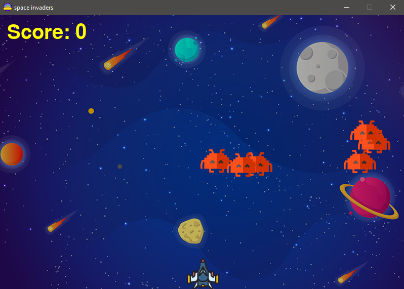

# Space Invaders👾

Space invaders is a simple python game built with Pygame as a clone of the famous [game.](https://en.wikipedia.org/wiki/Space_Invaders)

## Languages and technologies 🛠
* Python
* PyGame

## Requirements
* Python2 or [Python3](https://www.python.org/)(recommended)
* [PyGame](https://www.pygame.org/wiki/GettingStarted)

## Installation
1. Clone the repository by running `git clone https://github.com/JacobJax/spaceinvaders.git`
1. Run `python main.py`

## How its played
The game is pretty simple.

Use <kbd> < </kbd> to move to the and left <kbd> > </kbd> to move to the right.

Use <kbd>Space</kbd> to shoot